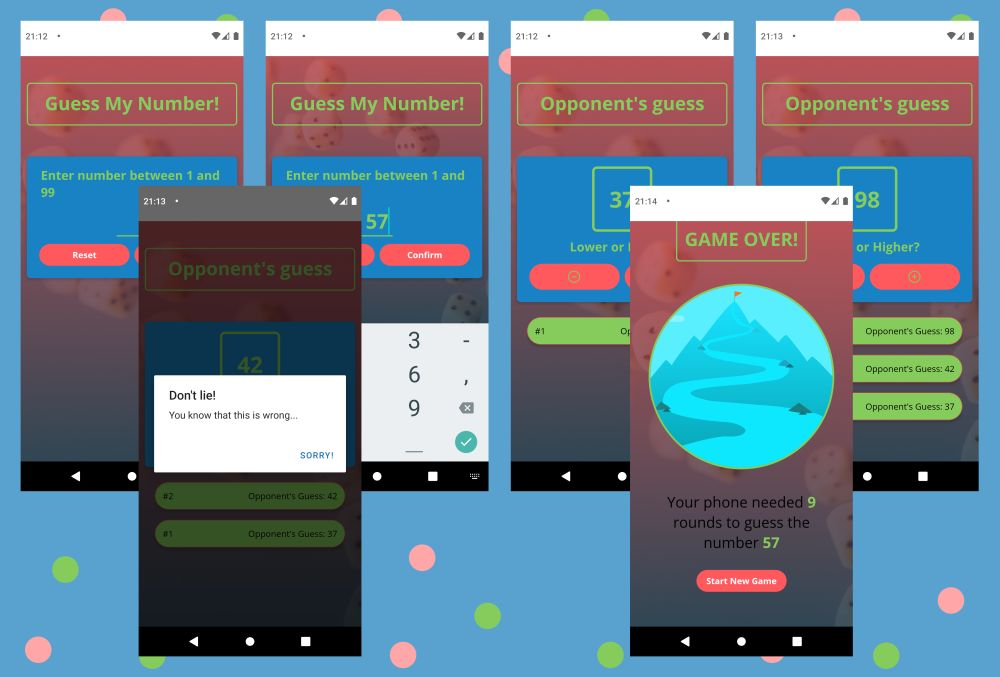

# My Projects

### React Native

1. [HandyMan](https://github.com/GosiaZaremba/Handyman "HandyMan") :wrench: :hammer: :house_with_garden:  
   React Native App for people in need of cleaning, laundry or repair services. App still in progress.
   

2. [Pet Nanny](https://github.com/GosiaZaremba/Projects/tree/main/React_Native/petnanny "Pet Nanny") :dog: :feet: :smiley_cat:  
   React Native app created for Android.  
   A React Native app, designed for pet owner for tracking feeding time, walks, madication and playtime. You can add multiple pets to track, add pet profile photo, and edit pet information any time. Connected to Firebase, so You have access to it on any device.  
   

3. [Guess My Number](https://github.com/GosiaZaremba/Projects/tree/main/React_Native/GuessMyNumber "Guess My Number") :sunglasses: 
   Simple React Native game app, created with Expo Go library.  
   Pick a number between 1 and 100 and the app will guess it! You can give hints if Your number is lower or higher than apps guess. When the app finally guesses the right number it will show a screen with how many rounds it took to find Your number.  

   
